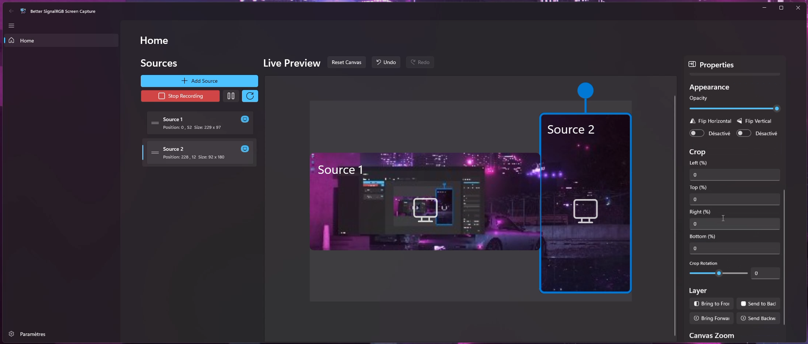

<!-- Improved compatibility of back to top link: See: https://github.com/othneildrew/Best-README-Template/pull/73 -->

<a name="readme-top"></a>

<!-- PROJECT SHIELDS -->
<div align="center">

[![Contributors][contributors-shield]][contributors-url]
[![Forks][forks-shield]][forks-url]
[![Stargazers][stars-shield]][stars-url]
[![Issues][issues-shield]][issues-url]
[![MIT License][license-shield]][license-url]

</div>

<!-- PROJECT LOGO -->
<br />
<div align="center">
  <a href="https://github.com/Fefedu973/Better-SignalRGB-Screen-Capture">
    
  </a>

  <h3 align="center">Better SignalRGB Screen Capture</h3>

  <p align="center">
    A powerful multi-source screen capture application with SignalRGB integration and ambilight effects
    <br />
    <a href="#usage"><strong>Explore the docs »</strong></a>
    <br />
    <br />
    <a href="demo.mp4">View Demo</a>
    ·
    <a href="https://github.com/Fefedu973/Better-SignalRGB-Screen-Capture/issues">Report Bug</a>
    ·
    <a href="https://github.com/Fefedu973/Better-SignalRGB-Screen-Capture/issues">Request Feature</a>
  </p>
</div>


<!-- DEMO SHOWCASE -->
<div align="center">
  
  <p><em>Real-time multi-source screen capture with customizable ambilight effects for SignalRGB</em></p>
</div>

---

<!-- TABLE OF CONTENTS -->
<details>
  <summary>Table of Contents</summary>
  <ol>
    <li>
      <a href="#about-the-project">About The Project</a>
      <ul>
        <li><a href="#built-with">Built With</a></li>
        <li><a href="#key-features">Key Features</a></li>
      </ul>
    </li>
    <li>
      <a href="#getting-started">Getting Started</a>
      <ul>
        <li><a href="#prerequisites">Prerequisites</a></li>
        <li><a href="#installation">Installation</a></li>
      </ul>
    </li>
    <li><a href="#usage">Usage</a>
      <ul>
        <li><a href="#adding-capture-sources">Adding Capture Sources</a></li>
        <li><a href="#signalrgb-integration">SignalRGB Integration</a></li>
        <li><a href="#mjpeg-streaming">MJPEG Streaming</a></li>
      </ul>
    </li>
    <li><a href="#signalrgb-effect">SignalRGB Effect</a></li>
    <li><a href="#api-endpoints">API Endpoints</a></li>
    <li><a href="#roadmap">Roadmap</a></li>
    <li><a href="#building-from-source">Building from Source</a></li>
    <li><a href="#contributing">Contributing</a></li>
    <li><a href="#license">License</a></li>
    <li><a href="#contact">Contact</a></li>
    <li><a href="#acknowledgments">Acknowledgments</a></li>
  </ol>
</details>

<!-- ABOUT THE PROJECT -->

## About The Project

Better SignalRGB Screen Capture is a Windows application that provides advanced screen capture capabilities with seamless SignalRGB integration. It allows you to capture multiple sources simultaneously (displays, windows, regions, webcams, and websites) and stream them with customizable ambilight effects to your RGB lighting setup.

The application bridges the gap between your screen content and RGB lighting by providing real-time frame capture, MJPEG streaming, and a sophisticated Canvas API that communicates directly with SignalRGB for immersive lighting experiences.

### Key Features

- **Multi-Source Capture**: Simultaneously capture from displays, windows, custom regions, webcams, and websites
- **SignalRGB Integration**: Direct integration with SignalRGB Canvas API for real-time ambilight effects
- **MJPEG Streaming**: Built-in web server for streaming captured content over HTTP
- **Advanced Controls**: Per-source positioning, scaling, rotation, mirroring, and cropping
- **Ambilight Effects**: Customizable ambilight with blur, saturation, and spread controls
- **Beat Pulse Sync**: Audio-reactive lighting effects with beat detection
- **Picture Modes**: Multiple visual modes (Standard, Cinema, Mono, Vivid, Dominant, HD)
- **Web Interface**: Browser-based control panel for remote management
- **Real-time Preview**: Live preview of all capture sources with visual feedback

<p align="right">(<a href="#readme-top">back to top</a>)</p>

### Built With

- [![WinUI3][WinUI3]][WinUI3-url]
- [![.NET][.NET]][.NET-url]
- [![C#][C#]][C#-url]
- [![ASP.NET Core][ASP.NET-Core]][ASP.NET-Core-url]

**Major Dependencies:**

- **WinUI 3** - Modern Windows UI framework
- **ScreenRecorderLib** - High-performance screen recording
- **Win2D** - 2D graphics API for Windows
- **CommunityToolkit.Mvvm** - MVVM helpers and patterns
- **H.NotifyIcon.WinUI** - System tray integration
- **WinUIEx** - Extended WinUI controls and utilities

<p align="right">(<a href="#readme-top">back to top</a>)</p>

<!-- GETTING STARTED -->

## Getting Started

### Prerequisites

- **Windows 10/11** (Version 1809 or later)
- **Windows App SDK** 1.8 or later
- **.NET 10.0** Runtime
- **SignalRGB** (for lighting effects integration)

### Installation

#### Option 1: Download Release (Recommended)

1. Go to the [Releases](https://github.com/Fefedu973/Better-SignalRGB-Screen-Capture/releases) page
2. Download the latest release package for your platform (x64, x86, or ARM64)
3. Extract the package to your desired location
4. Run `Better-SignalRGB-Screen-Capture.exe`

#### Option 2: Build from Source

1. Clone the repository
   ```sh
   git clone https://github.com/Fefedu973/Better-SignalRGB-Screen-Capture.git
   ```
2. Navigate to the project directory
   ```sh
   cd BetterSignalRGBScreenCapture/Better-SignalRGB-Screen-Capture
   ```
3. Restore dependencies
   ```sh
   dotnet restore
   ```
4. Build the application
   ```sh
   dotnet build --configuration Release
   ```
5. Run the application
   ```sh
   dotnet run
   ```

<p align="right">(<a href="#readme-top">back to top</a>)</p>

<!-- USAGE EXAMPLES -->

## Usage

### Adding Capture Sources

1. **Launch the Application**: Start Better SignalRGB Screen Capture
2. **Add Sources**: Click the "+" button to add new capture sources

   - **Display**: Capture entire monitors
   - **Window**: Capture specific application windows
   - **Region**: Define custom screen regions
   - **Webcam**: Add camera feeds
   - **Website**: Embed web content

3. **Configure Sources**:
   - Position sources on the canvas by dragging
   - Adjust size, rotation, and opacity using the controls
   - Set up cropping for precise content selection

### SignalRGB Integration

1. **Install SignalRGB Effect**:

   - Copy `Better-SignalRGB-Screen-Capture-Effect.html` to your SignalRGB effects folder
   - Typically located at: `Documents/WhirlwindFX/effects`

2. **Configure the Effect**:

   - Open SignalRGB and navigate to Effects
   - Select "Better SignalRGB Screen Capture" effect
   - Adjust ambilight settings (spread, blur, saturation)
   - Configure screen positioning and size

3. **Start Capture**:
   - Launch the capture application
   - Add your desired sources
   - SignalRGB will automatically receive frames via the Canvas API

### MJPEG Streaming

The application provides HTTP endpoints for external access:

- **All Sources Stream**: `http://localhost:8080/stream`
- **Individual Source**: `http://localhost:8080/stream/{sourceId}`
- **Canvas View**: `http://localhost:8080/canvas`
- **API Endpoints**: `http://localhost:8080/api/sources`

<p align="right">(<a href="#readme-top">back to top</a>)</p>

## SignalRGB Effect

The included HTML effect (`Better-SignalRGB-Screen-Capture-Effect.html`) provides:

### Ambilight Controls

- **Ambilight Effect**: Toggle ambilight on/off
- **Saturation**: Control color intensity (1-10)
- **Spread**: Adjust effect coverage (1-100)
- **Blur**: Configure blur amount (10-100)
- **Full-screen**: Enable full-screen ambilight mode

### Picture Modes

- **Standard**: Default balanced settings
- **Cinema**: Sepia tint with enhanced contrast
- **Mono**: Grayscale mode
- **Vivid**: High contrast and saturation
- **Dominant**: Enhanced contrast with moderate saturation
- **HD**: Subtle enhancements for clarity

### Beat Pulse Integration

- **Beat Pulse**: Enable audio-reactive effects
- **Pulse Strength**: Control intensity (0-300%)
- **Beat Sensitivity**: Adjust detection threshold

## API Endpoints

| Endpoint        | Method | Description                          |
| --------------- | ------ | ------------------------------------ |
| `/stream`       | GET    | Combined MJPEG stream of all sources |
| `/stream/{id}`  | GET    | Individual source MJPEG stream       |
| `/canvas`       | GET    | Web-based canvas viewer              |
| `/api/sources`  | GET    | JSON list of active sources          |
| `/canvas/event` | POST   | SignalRGB Canvas API endpoint        |

<!-- ROADMAP -->

## Roadmap

- [ ] **Fix All Known Issues**

  - [ ] Resolve crash issues
  - [ ] Resolve crop rotation render on the effect
  - [ ] Resolve failed recording for small sources and big regions
  - [ ] Resolve failed recording all sources on startup

- [ ] **Add Localization**

- [ ] **Add Virtual Screen**

- [ ] **Proper Setup Wizard**

See the [open issues](https://github.com/Fefedu973/Better-SignalRGB-Screen-Capture/issues) for a full list of proposed features and known issues.

<p align="right">(<a href="#readme-top">back to top</a>)</p>

## Building from Source

### Development Prerequisites

- **Visual Studio 2022** with Windows App SDK workload
- **.NET 10.0 SDK**
- **Windows 11 SDK** (22000 or later)

### Build Configuration

```xml
<TargetFramework>net10.0-windows10.0.22000.0</TargetFramework>
<TargetPlatformMinVersion>10.0.17763.0</TargetPlatformMinVersion>
<UseWinUI>true</UseWinUI>
<Platforms>x86;x64;arm64</Platforms>
```

### Build Commands

```bash
# Debug build
dotnet build --configuration Debug

# Release build
dotnet build --configuration Release

# Publish for distribution
dotnet publish --configuration Release --self-contained true
```

<p align="right">(<a href="#readme-top">back to top</a>)</p>

<!-- CONTRIBUTING -->

## Contributing

Contributions are what make the open source community such an amazing place to learn, inspire, and create. Any contributions you make are **greatly appreciated**.

If you have a suggestion that would make this better, please fork the repo and create a pull request. You can also simply open an issue with the tag "enhancement".
Don't forget to give the project a star! Thanks again!

1. Fork the Project
2. Create your Feature Branch (`git checkout -b feature/AmazingFeature`)
3. Commit your Changes (`git commit -m 'Add some AmazingFeature'`)
4. Push to the Branch (`git push origin feature/AmazingFeature`)
5. Open a Pull Request

<p align="right">(<a href="#readme-top">back to top</a>)</p>

<!-- LICENSE -->

## License

Distributed under the MIT License. See `LICENSE.txt` for more information.

<p align="right">(<a href="#readme-top">back to top</a>)</p>

<!-- CONTACT -->

## Contact

Project Link: [https://github.com/Fefedu973/Better-SignalRGB-Screen-Capture](https://github.com/Fefedu973/Better-SignalRGB-Screen-Capture)

<p align="right">(<a href="#readme-top">back to top</a>)</p>

<!-- ACKNOWLEDGMENTS -->

## Acknowledgments

- [SignalRGB](https://signalrgb.com/) - For the amazing RGB lighting platform
- [ScreenRecorderLib](https://github.com/sskodje/ScreenRecorderLib) - High-performance screen recording
- [WinUI 3](https://docs.microsoft.com/en-us/windows/apps/winui/winui3/) - Modern Windows UI framework
- [Win2D](https://github.com/Microsoft/Win2D) - 2D graphics for Windows
- [CommunityToolkit](https://github.com/CommunityToolkit) - Essential MVVM and UI utilities
- [Best-README-Template](https://github.com/othneildrew/Best-README-Template) - This README template

<p align="right">(<a href="#readme-top">back to top</a>)</p>

<!-- MARKDOWN LINKS & IMAGES -->
<!-- https://www.markdownguide.org/basic-syntax/#reference-style-links -->

[contributors-shield]: https://img.shields.io/github/contributors/Fefedu973/Better-SignalRGB-Screen-Capture.svg?style=for-the-badge
[contributors-url]: https://github.com/Fefedu973/Better-SignalRGB-Screen-Capture/graphs/contributors
[forks-shield]: https://img.shields.io/github/forks/Fefedu973/Better-SignalRGB-Screen-Capture.svg?style=for-the-badge
[forks-url]: https://github.com/Fefedu973/Better-SignalRGB-Screen-Capture/network/members
[stars-shield]: https://img.shields.io/github/stars/Fefedu973/Better-SignalRGB-Screen-Capture.svg?style=for-the-badge
[stars-url]: https://github.com/Fefedu973/Better-SignalRGB-Screen-Capture/stargazers
[issues-shield]: https://img.shields.io/github/issues/Fefedu973/Better-SignalRGB-Screen-Capture.svg?style=for-the-badge
[issues-url]: https://github.com/Fefedu973/Better-SignalRGB-Screen-Capture/issues
[license-shield]: https://img.shields.io/github/license/Fefedu973/Better-SignalRGB-Screen-Capture.svg?style=for-the-badge
[license-url]: https://github.com/Fefedu973/Better-SignalRGB-Screen-Capture/blob/master/LICENSE.txt
[WinUI3]: https://img.shields.io/badge/WinUI3-0078D4?style=for-the-badge&logo=microsoft&logoColor=white
[WinUI3-url]: https://docs.microsoft.com/en-us/windows/apps/winui/winui3/
[.NET]: https://img.shields.io/badge/.NET-512BD4?style=for-the-badge&logo=dotnet&logoColor=white
[.NET-url]: https://dotnet.microsoft.com/
[C#]: https://img.shields.io/badge/C%23-239120?style=for-the-badge&logo=c-sharp&logoColor=white
[C#-url]: https://docs.microsoft.com/en-us/dotnet/csharp/
[ASP.NET-Core]: https://img.shields.io/badge/ASP.NET_Core-512BD4?style=for-the-badge&logo=dotnet&logoColor=white
[ASP.NET-Core-url]: https://docs.microsoft.com/en-us/aspnet/core/
