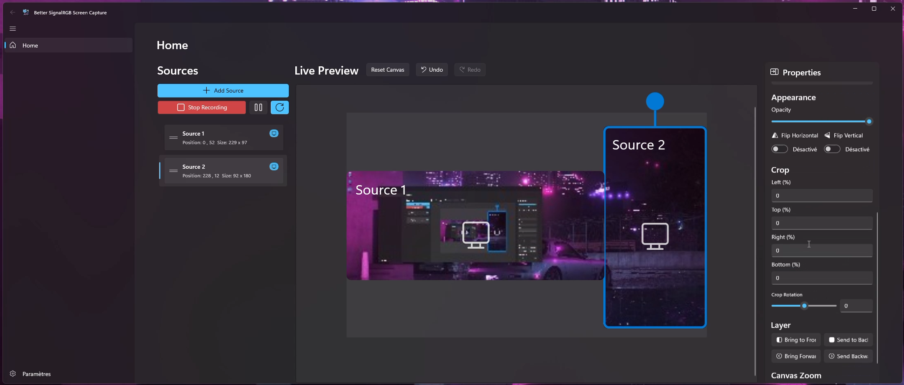

<!-- Improved compatibility of back to top link: See: https://github.com/othneildrew/Best-README-Template/pull/73 -->

<a name="readme-top"></a>

<!-- PROJECT SHIELDS -->
<div align="center">

[![Contributors][contributors-shield]][contributors-url]
[![Forks][forks-shield]][forks-url]
[![Stargazers][stars-shield]][stars-url]
[![Issues][issues-shield]][issues-url]
[![MIT License][license-shield]][license-url]

</div>

<!-- PROJECT LOGO -->
<br />
<div align="center">
  <a href="https://github.com/Fefedu973/Better-SignalRGB-Screen-Capture">
    
  </a>

  <h3 align="center">Better SignalRGB Screen Capture</h3>

  <p align="center">
    A powerful multi-source screen capture application with SignalRGB integration and ambilight effects
    <br />
    <a href="#usage"><strong>Explore the docs »</strong></a>
    <br />
    <br />
    <a href="demo.mp4">View Demo</a>
    ·
    <a href="https://github.com/Fefedu973/Better-SignalRGB-Screen-Capture/issues">Report Bug</a>
    ·
    <a href="https://github.com/Fefedu973/Better-SignalRGB-Screen-Capture/issues">Request Feature</a>
  </p>
</div>


<!-- DEMO SHOWCASE -->
<div align="center">
  
  <p><em>Real-time multi-source screen capture with customizable ambilight effects for SignalRGB</em></p>
</div>

---

<!-- TABLE OF CONTENTS -->
<details>
  <summary>Table of Contents</summary>
  <ol>
    <li>
      <a href="#about-the-project">About The Project</a>
      <ul>
        <li><a href="#built-with">Built With</a></li>
        <li><a href="#key-features">Key Features</a></li>
      </ul>
    </li>
    <li>
      <a href="#getting-started">Getting Started</a>
      <ul>
        <li><a href="#prerequisites">Prerequisites</a></li>
        <li><a href="#installation">Installation</a></li>
      </ul>
    </li>
    <li><a href="#usage">Usage</a>
      <ul>
        <li><a href="#adding-capture-sources">Adding Capture Sources</a></li>
        <li><a href="#signalrgb-integration">SignalRGB Integration</a></li>
        <li><a href="#mjpeg-streaming">MJPEG Streaming</a></li>
      </ul>
    </li>
    <li><a href="#signalrgb-effect">SignalRGB Effect</a></li>
    <li><a href="#api-endpoints">API Endpoints</a></li>
    <li><a href="#roadmap">Roadmap</a></li>
    <li><a href="#building-from-source">Building from Source</a></li>
    <li><a href="#contributing">Contributing</a></li>
    <li><a href="#license">License</a></li>
    <li><a href="#contact">Contact</a></li>
    <li><a href="#acknowledgments">Acknowledgments</a></li>
  </ol>
</details>

<!-- ABOUT THE PROJECT -->

## About The Project

Better SignalRGB Screen Capture is a Windows application that provides advanced screen capture capabilities with seamless SignalRGB integration. It allows you to capture multiple sources simultaneously (displays, windows, regions, webcams, and websites) and stream them with customizable ambilight effects to your RGB lighting setup.

The application bridges the gap between your screen content and RGB lighting by providing real-time frame capture, MJPEG streaming, and a sophisticated Canvas API that communicates directly with SignalRGB for immersive lighting experiences.

### Key Features

- **Multi-Source Capture**: Simultaneously capture from displays, windows, custom regions, webcams, websites, and Wallpaper Engine
- **Wallpaper Engine**: Capture the actual rendered wallpaper on a selected monitor, including behind other applications; web, scene and video use the same capture path
- **SignalRGB Integration**: Direct integration with SignalRGB Canvas API for real-time ambilight effects
- **MJPEG Streaming**: Built-in web server for streaming captured content over HTTP
- **Advanced Controls**: Per-source positioning, scaling, rotation, mirroring, and cropping
- **Ambilight Effects**: Customizable ambilight with blur, saturation, and spread controls
- **Beat Pulse Sync**: Audio-reactive lighting effects with beat detection
- **Picture Modes**: Multiple visual modes (Standard, Cinema, Mono, Vivid, Dominant, HD)
- **Web Output**: Clean, full-page RGB output for browser effects, with optional picture filters and ambilight controlled from the app
- **App Effect Controls**: Optional live picture, halo, interpolation and update-rate settings from the application
- **Guided Setup**: Detect and update the matching SignalRGB effect, with separate API and rendered-image connection checks
- **Scenes**: Save, replace, rename, load, import and export named source layouts
- **Canvas Tools**: Persistent layout locks, snapping and visible alignment guides
- **Diagnostics**: Live capture, processing, sending, dropped-frame and error counters
- **Real-time Preview**: Live preview of all capture sources with visual feedback

<p align="right">(<a href="#readme-top">back to top</a>)</p>

### Built With

- [![WinUI3][WinUI3]][WinUI3-url]
- [![.NET][.NET]][.NET-url]
- [![C#][C#]][C#-url]
- [![ASP.NET Core][ASP.NET-Core]][ASP.NET-Core-url]

**Major Dependencies:**

- **WinUI 3** - Modern Windows UI framework
- **ScreenRecorderLib** - High-performance screen recording
- **Win2D** - 2D graphics API for Windows
- **CommunityToolkit.Mvvm** - MVVM helpers and patterns
- **H.NotifyIcon.WinUI** - System tray integration
- **WinUIEx** - Extended WinUI controls and utilities

<p align="right">(<a href="#readme-top">back to top</a>)</p>

<!-- GETTING STARTED -->

## Getting Started

### Prerequisites

- **Windows 11** is the tested platform; Windows 10 has not been covered by the current hardware validation
- The portable release bundles **.NET** and the **Windows App SDK**; extract the entire archive before launching
- **Microsoft Edge WebView2 Runtime** for website and local media sources
- **Microsoft Visual C++ v14 Redistributable** matching the application architecture ([official downloads](https://learn.microsoft.com/en-us/cpp/windows/latest-supported-vc-redist)); native screen capture uses this runtime
- **SignalRGB** (for lighting effects integration)

### Installation

#### Option 1: Download Release (Recommended)

1. Go to the [Releases](https://github.com/Fefedu973/Better-SignalRGB-Screen-Capture/releases) page
2. Download the release archive matching your platform (x64, x86, or ARM64); consult its release notes for validation coverage
3. Extract the package to your desired location
4. Run `Better-SignalRGB-Screen-Capture.exe`

When upgrading, quit the previous instance from its tray menu, then extract the new version into its own folder. Settings remain in your local application-data folder. Update the bundled effect through **Settings → SignalRGB setup** to use the matching app/effect protocol. The release includes `SHA256SUMS.txt` to verify downloads.

#### Option 2: Build from Source

1. Clone the repository
   ```sh
   git clone https://github.com/Fefedu973/Better-SignalRGB-Screen-Capture.git
   ```
2. Navigate to the project directory
   ```sh
   cd BetterSignalRGBScreenCapture/Better-SignalRGB-Screen-Capture
   ```
3. Restore dependencies
   ```sh
   dotnet restore
   ```
4. Build the application
   ```sh
   dotnet build --configuration Release -p:Platform=x64
   ```
5. Run the application
   ```sh
   dotnet run -p:Platform=x64
   ```

<p align="right">(<a href="#readme-top">back to top</a>)</p>

<!-- USAGE EXAMPLES -->

## Usage

### Adding Capture Sources

1. **Launch the Application**: Start Better SignalRGB Screen Capture
2. **Add Sources**: Click the "+" button to add new capture sources

   - **Display**: Capture entire monitors
   - **Window**: Capture specific application windows
   - **Region**: Define custom screen regions
   - **Webcam**: Add camera feeds
   - **Website**: Capture an HTTP/HTTPS page or a local `file:///` address; **Choose local file…** accepts HTML, images and browser-supported videos
   - **Wallpaper Engine**: Select the display whose live wallpaper should be captured, independently of foreground applications

Recording starts automatically when the application launches unless you explicitly disable **Auto-start recording** in Settings. Wallpaper Engine must itself remain running and rendering: its own pause/stop rules still determine whether new animation frames exist.

Website capture uses an independent browser so opening Settings or hiding the editor does not suspend the page. Local images fit within the configured viewport; local videos play muted in a loop. Local file addresses, including escaped spaces and Unicode names, are retained in scenes. The setup preview helps choose the URL and viewport; transient interactive page state is not copied into capture.

3. **Configure Sources**:
   - Position sources on the canvas by dragging
   - Adjust size, rotation, and opacity using the controls
   - Set up cropping for precise content selection

### Canvas Editing

Select and move a source by its visible content; cropped-away areas do not intercept clicks. Resize handles follow the visible frame, and rotation keeps its visible center fixed. Hold Shift while resizing to retain the aspect ratio. A rotated crop uses uniform scaling when independent-axis resizing would require skewing the image.

Ctrl-click changes the selection; dragging empty space selects an area. Arrow keys move the selection by one canvas pixel, or ten with Shift. Middle-button dragging pans. Right-click a source to edit its crop, then Enter to apply or Esc to cancel. Mirroring flips image content inside the existing crop. Ctrl+Z and Ctrl+Y undo and redo committed edits.

Enable **Snap** in the canvas toolbar to align visible source edges and centers with the canvas or other sources. Guides appear during dragging and resizing, with a six-screen-pixel attraction distance at every zoom level. Hold **Alt** to bypass snapping for the current gesture. Cropping and rotation are included when measuring the visible bounds.

Enable **HQ 800 × 600** in the canvas toolbar for a more detailed web output and live preview. Sources retain their relative placement, crops and rotations automatically. Capture supplies more pixels and the web composite uses higher JPEG quality; SignalRGB's Canvas API keeps its original low-resolution output and delivery rate. The choice is saved across restarts. Switching modes preserves recording/pause state and does not disconnect web viewers. HQ uses more capture, encoding and network resources.

Use **Lock layout** in the properties panel or the source context menu to protect position, size, rotation, crop, mirroring and layer commands. Locked sources remain selectable and show a lock badge. A selection containing any locked source cannot be transformed; unlock the selection first. Names and opacity remain editable, copy and delete remain available, and pasted copies start unlocked. Locks are preserved in saved layouts, scenes and undo history.

Website sources use the configured browser viewport, zoom and user agent in both the interactive setup preview and capture. Saving after navigating in the preview uses that page's final HTTP(S) address; typing a different address without loading it uses the newly typed address. Hiding live preview keeps the capture browser available. Repeated browser capture errors stop that source and appear in diagnostics.

### Scenes and Diagnostics

Open **Scenes** in the canvas toolbar to save the current source layout under a name, load another scene, replace a saved scene, rename it or delete it. JSON import/export carries source identities, geometry, crops, appearance and locks. Loading a scene is undoable and preserves the current recording/pause state. Global capture rates and SignalRGB effect preferences are not part of a scene. Device identities may need editing when importing on another computer.

Open **Diagnostics** to inspect each source's requested and actual frame rates, JPEG dimensions, processing time, replaced or skipped frames and last error. Transport counters distinguish source-image updates from actual effect redraws. Hardware mode describes the internal H.264 recorder; JPEG processing still runs on the CPU.

### SignalRGB Integration

1. **Install SignalRGB Effect**:

   - Open **Settings → SignalRGB effect → Connect SignalRGB** and use **Install / update effect**.
   - The app detects the installed version's effects folder and compares the bundled effect with the installed file. You can choose another folder explicitly. Updating keeps a backup of the previous file.
   - For manual installation, copy `Better-SignalRGB-Screen-Capture-Effect.html` to the effects folder. Current installations use `%LOCALAPPDATA%/VortxEngine/app-VERSION/Signal-x64/Effects/Dynamic`; the legacy `Documents/WhirlwindFX/Effects` folder is also detected. See the [SignalRGB lightscript documentation](https://docs.signalrgb.com/lightscripts).

2. **Configure the Effect**:

   - Restart SignalRGB after installing the effect and navigate to Effects
   - Select "Better SignalRGB Screen Capture" effect
   - Adjust ambilight settings (spread, blur, saturation)
   - Configure screen positioning and size

3. **Start Capture**:
   - Launch the capture application
   - Add your desired sources
   - Start recording and streaming. SignalRGB receives frames via the Canvas API.
   - Use the setup connection check to distinguish an API response from the matching effect confirming that it has drawn captured images. This does not verify physical LED output.

4. **Optional App Controls**:
   - Open **Output editor → Control SignalRGB appearance from this app**. **Settings** retains the installation and connection checks, with a link to the output editor.
   - Adjust global picture placement, picture preset, hue, brightness, saturation, blur, halo, interpolation and the update rate (1–30 FPS) beside a live preview.
   - Changes apply while streaming. Turning app control off restores SignalRGB's own appearance controls and the application's default 15 FPS delivery rate.
   - Install the matching HTML effect included beside the built application; older effect files do not understand these settings. Audio beat controls remain in SignalRGB.

### MJPEG Streaming

The application provides HTTP endpoints for external access:

- **All Sources Stream**: `http://localhost:8080/stream`
- **Individual Source**: `http://localhost:8080/stream/{sourceId}`
- **Clean Web Output**: `http://localhost:8080/` (also `/canvas`)
- **API Endpoints**: `http://localhost:8080/api/sources`

The root page and `/canvas` fill the viewport without labels, controls, debug overlays or scrollbars. Use this page as a browser effect in OpenRGB or another application. The same page is available on the configured HTTPS port (for example, `https://localhost:18443/`). It reconnects automatically after interruption and adapts to live quality changes.

In **Output editor**, enable **Apply effects to the web output** to apply placement, picture modes, hue, brightness, saturation, blur, halo spread/blur/saturation/intensity, full-area halo, picture hiding, interpolation and the effect frame-rate limit. Changes apply live even when source images are unchanged, provided streaming remains active. Pausing or stopping capture also stops streaming. These appearance settings are shared with SignalRGB, but each output has its own activation switch: the webpage works without SignalRGB running. Turn the web switch off to restore the raw canvas. The switch is off by default for existing installations.

The output editor previews appearance even before either output is enabled. Drag the picture or use its eight resize handles to leave room for the halo; **Fill**, **Inset** and **Center** offer quick placements. Arrow keys nudge the focused picture, Shift makes larger nudges or preserves aspect ratio while resizing, and Escape cancels a drag. Numeric placement uses a consistent 320 × 200 coordinate area in both quality modes. Opening the editor does not start a stopped capture.

The halo offers **Classic** expansion and **Soft** near/far diffusion, plus a dark-color cutoff that suppresses dim colors without altering the picture. Both styles use the current frame without temporal smoothing, keeping the response immediate. Existing saved color and halo preferences are retained when moving from Settings to Output.

The web effect uses the full available source detail and transparent source geometry, so halos follow cropped, rotated and mirrored sources. Enable **HQ 800 × 600** for the larger output; the halo size and layout keep the same proportions. One connection carries layout/settings updates and the latest cached JPEGs, with bounded decoding instead of an accumulating frame queue. The webpage stays visually clean in both modes. `/stream` remains the raw composite MJPEG endpoint and is unaffected by appearance settings.

<p align="right">(<a href="#readme-top">back to top</a>)</p>

## SignalRGB Effect

The included HTML effect (`Better-SignalRGB-Screen-Capture-Effect.html`) provides:

### Ambilight Controls

- **Ambilight Effect**: Toggle ambilight on/off
- **Saturation**: Control color intensity (0-10)
- **Spread**: Adjust effect coverage (0-100)
- **Blur**: Configure blur amount (0-100)
- **Intensity**: Adjust halo brightness (0-200%)
- **Full-screen**: Enable full-screen ambilight mode

### Picture Modes

- **Standard**: Default balanced settings
- **Cinema**: Sepia tint with enhanced contrast
- **Mono**: Grayscale mode
- **Vivid**: High contrast and saturation
- **Dominant**: Enhanced contrast with moderate saturation
- **HD**: Subtle enhancements for clarity

### Beat Pulse Integration

- **Beat Pulse**: Enable audio-reactive effects
- **Pulse Strength**: Control intensity (0-300%)
- **Beat Sensitivity**: Adjust detection threshold

## API Endpoints

| Endpoint        | Method | Description                          |
| --------------- | ------ | ------------------------------------ |
| `/stream`       | GET    | Combined MJPEG stream of all sources |
| `/stream/{id}`  | GET    | Individual source MJPEG stream       |
| `/`, `/canvas`  | GET    | Clean, full-viewport RGB output       |
| `/web-stream`   | GET    | Webpage transport: versioned state and latest JPEGs in one multipart connection |
| `/api/sources`  | GET    | JSON list of active sources          |
| `/api/canvasinfo` | GET  | Canvas dimensions and active source layouts |

These routes use the application's configured HTTP/HTTPS ports. SignalRGB's separate Canvas API receives events at `http://localhost:16034/canvas/event`; it is not an endpoint hosted by this application.

`/api/canvasinfo` describes the stable 320 × 200 layout coordinates. Rendered web JPEGs are 320 × 200 normally or 800 × 600 in HQ mode; changing output quality does not rewrite scene coordinates.

<!-- ROADMAP -->

## Roadmap

- [ ] **Fix All Known Issues**

  - [ ] Resolve crash issues
  - [x] Correct crop/source rotation and mirror composition (compositor and browser regression checks)
  - [x] Handle tiny/odd sources and bound large capture outputs (native resolution matrix)
  - [x] Coordinate source loading, availability and recording startup (state-transition tests)

- [ ] **Add Localization**

- [ ] **Add Virtual Screen**

- [ ] **Proper Setup Wizard**

See the [open issues](https://github.com/Fefedu973/Better-SignalRGB-Screen-Capture/issues) for a full list of proposed features and known issues.

<p align="right">(<a href="#readme-top">back to top</a>)</p>

## Building from Source

### Development Prerequisites

- **Visual Studio 2022** with Windows App SDK workload
- **.NET 10.0 SDK**
- **Windows 11 SDK** (22000 or later)

### Build Configuration

```xml
<TargetFramework>net10.0-windows10.0.22000.0</TargetFramework>
<TargetPlatformMinVersion>10.0.17763.0</TargetPlatformMinVersion>
<UseWinUI>true</UseWinUI>
<Platforms>x86;x64;arm64</Platforms>
```

### Build Commands

```bash
# Debug build, from the repository root
dotnet build Better-SignalRGB-Screen-Capture/Better-SignalRGB-Screen-Capture.csproj -c Debug -p:Platform=x64

# Release build
dotnet build Better-SignalRGB-Screen-Capture/Better-SignalRGB-Screen-Capture.csproj -c Release -p:Platform=x64

# Publish for distribution
dotnet publish Better-SignalRGB-Screen-Capture/Better-SignalRGB-Screen-Capture.csproj -c Release -p:Platform=x64 --self-contained true
```

### Capture and canvas regression checks

The capture pipeline, canvas editor, streaming services and SignalRGB effect have a shared regression suite. See [the overhaul report](docs/quality-and-performance-review.md) for the fixes, reproduced encoder failures and verification boundaries.

From the repository root:

```powershell
dotnet run --project tests/BetterSignalRGB.RegressionTests -c Release
dotnet run --project tests/BetterSignalRGB.ViewModelTests -c Release
dotnet run --project tests/BetterSignalRGB.StreamingTests -c Release
node tests/StreamingEffectTests.cjs
```

The streaming integration checks use generated images and exercise the production compositor and local HTTP/HTTPS servers. They create and remove a temporary HTTPS certificate in the test output directory, without installing it in the trust store or sending frames to SignalRGB.

The browser pixel checks use the pinned development dependencies in `tests` (Node 20 or later):

```powershell
npm ci --prefix tests --ignore-scripts
Push-Location tests
npx playwright install chromium
npm run test:browser
Pop-Location
```

They compare the actual HTML effect against generated production compositor images and an independent transform oracle. See [effect rendering validation](docs/signalrgb-effect-validation.md) for details and host-level verification boundaries.

Native resolution tests are available separately and briefly capture the connected displays in memory:

```powershell
dotnet run --project tests/BetterSignalRGB.NativeSmokeTests -c Release -- --capture-display
```

<p align="right">(<a href="#readme-top">back to top</a>)</p>

<!-- CONTRIBUTING -->

## Contributing

Contributions are what make the open source community such an amazing place to learn, inspire, and create. Any contributions you make are **greatly appreciated**.

If you have a suggestion that would make this better, please fork the repo and create a pull request. You can also simply open an issue with the tag "enhancement".
Don't forget to give the project a star! Thanks again!

1. Fork the Project
2. Create your Feature Branch (`git checkout -b feature/AmazingFeature`)
3. Commit your Changes (`git commit -m 'Add some AmazingFeature'`)
4. Push to the Branch (`git push origin feature/AmazingFeature`)
5. Open a Pull Request

<p align="right">(<a href="#readme-top">back to top</a>)</p>

<!-- LICENSE -->

## License

Distributed under the MIT License. See `LICENSE.txt` for more information.

<p align="right">(<a href="#readme-top">back to top</a>)</p>

<!-- CONTACT -->

## Contact

Project Link: [https://github.com/Fefedu973/Better-SignalRGB-Screen-Capture](https://github.com/Fefedu973/Better-SignalRGB-Screen-Capture)

<p align="right">(<a href="#readme-top">back to top</a>)</p>

<!-- ACKNOWLEDGMENTS -->

## Acknowledgments

- [SignalRGB](https://signalrgb.com/) - For the amazing RGB lighting platform
- [ScreenRecorderLib](https://github.com/sskodje/ScreenRecorderLib) - High-performance screen recording
- [WinUI 3](https://docs.microsoft.com/en-us/windows/apps/winui/winui3/) - Modern Windows UI framework
- [Win2D](https://github.com/Microsoft/Win2D) - 2D graphics for Windows
- [CommunityToolkit](https://github.com/CommunityToolkit) - Essential MVVM and UI utilities
- [Best-README-Template](https://github.com/othneildrew/Best-README-Template) - This README template

<p align="right">(<a href="#readme-top">back to top</a>)</p>

<!-- MARKDOWN LINKS & IMAGES -->
<!-- https://www.markdownguide.org/basic-syntax/#reference-style-links -->

[contributors-shield]: https://img.shields.io/github/contributors/Fefedu973/Better-SignalRGB-Screen-Capture.svg?style=for-the-badge
[contributors-url]: https://github.com/Fefedu973/Better-SignalRGB-Screen-Capture/graphs/contributors
[forks-shield]: https://img.shields.io/github/forks/Fefedu973/Better-SignalRGB-Screen-Capture.svg?style=for-the-badge
[forks-url]: https://github.com/Fefedu973/Better-SignalRGB-Screen-Capture/network/members
[stars-shield]: https://img.shields.io/github/stars/Fefedu973/Better-SignalRGB-Screen-Capture.svg?style=for-the-badge
[stars-url]: https://github.com/Fefedu973/Better-SignalRGB-Screen-Capture/stargazers
[issues-shield]: https://img.shields.io/github/issues/Fefedu973/Better-SignalRGB-Screen-Capture.svg?style=for-the-badge
[issues-url]: https://github.com/Fefedu973/Better-SignalRGB-Screen-Capture/issues
[license-shield]: https://img.shields.io/github/license/Fefedu973/Better-SignalRGB-Screen-Capture.svg?style=for-the-badge
[license-url]: https://github.com/Fefedu973/Better-SignalRGB-Screen-Capture/blob/master/LICENSE.txt
[WinUI3]: https://img.shields.io/badge/WinUI3-0078D4?style=for-the-badge&logo=microsoft&logoColor=white
[WinUI3-url]: https://docs.microsoft.com/en-us/windows/apps/winui/winui3/
[.NET]: https://img.shields.io/badge/.NET-512BD4?style=for-the-badge&logo=dotnet&logoColor=white
[.NET-url]: https://dotnet.microsoft.com/
[C#]: https://img.shields.io/badge/C%23-239120?style=for-the-badge&logo=c-sharp&logoColor=white
[C#-url]: https://docs.microsoft.com/en-us/dotnet/csharp/
[ASP.NET-Core]: https://img.shields.io/badge/ASP.NET_Core-512BD4?style=for-the-badge&logo=dotnet&logoColor=white
[ASP.NET-Core-url]: https://docs.microsoft.com/en-us/aspnet/core/

OpenRGB integration feasibility and image/LED transport limits are documented in [the integration assessment](docs/openrgb-integration-assessment.md). The clean web output is available for browser effects; no direct OpenRGB SDK output is implemented.
